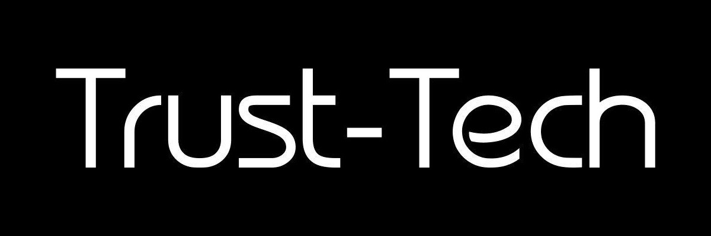

# TDR(Trust Decentralized Reserve) Contracts v0.1 (alpha)

We introduced TDR(Trust Decentralized Reserve), a standard Smart Token with built-in convertibility directly through the smart contracts, to solve the problem of liquidity and price discovery without any third or even second party, it can also be used to purchase TTT at a much more preferable price later at Pre-TSD Beta(b). TDR is distributed at Pre-TSD Alpha(α) and it utilizes an innovative token "Connector" method to enable formulaic price-calculation and continuous liquidity to/from all tokens in the Trust Decentralized Reserve, without needing to match two parties in an exchange. Smart Tokens interconnect to form token liquidity networks, allowing user-generated cryptocurrencies to thrive. For more information, visit the [website](http://trust-tech.org) and read the Token Distribution Economics Blackpaper [Blackpaper](https://github.com/trust-tech/Blackpaper).

# High Level Overview
To implement the Trustmachine, there are two pre stages of Trustmachine Scattered Distribution(TSD) which are Pre-TSD Alpha($\alpha$) and Pre-TSD Beta($\beta$). Each of them are crucial and thus unavoidable. Trustmachine Decentralized Reserve(TDR) is distributed at Pre-TSD Alpha($\alpha$) to kickstart the trustmachine project and further one-way liquidize into The Trustmachine Token(TTT) before TSD Lambda($\lambda$), which means a migration of value from TDR to TTT before the deployment of Mainnet. However, before genesis, TTT remains non-circulable and only distributed in the stage of Pre-TSD Beta($\beta$) accepting ETH and TDR with 25\% discount.

## Signature Verification And Message Encryption
Digital signature is a process ensuring that a certain package was generated by its developers and has not been tampered with.
Below we explain why it is important and how to verify that the blackpaper as well as some other software you download is the one
we have created and has not been modified by some attacker. Digital signature is a cryptographic mechanism. 
f you want to learn
more about how it works see https://en.wikipedia.org/wiki/Digital_signature.
### What Is A Signature And Why Should I Check It? How do you know that the software you have is really the one we made?
Digital signatures ensure that the package you are downloading was created by our developers. It uses a cryptographic mechanism to
ensure that the software package that you have just downloaded is authentic. For every user it is a must to verify that the software
is authentic as they have very real adversaries who might try to give them a fake version. If the software package as well as the
blackpaper has been modified by some attacker it is not safe to use. It doesn’t matter how secure our package is if you’re not running
the real one. Before you go ahead and download something, there are a few extra steps you should take to make sure you have
downloaded an authentic version. Below is an example of how to verify whether the blackpaper.pdf is the one that we produce:
1. Import the public key of trust-tech.org(trust-tech@protonmail.com):
```
    gpg --keyserver keys.gnupg.net --recv-keys 04BDC75EA19166D13F3F151448826F5500731B61
```
2. After importing the key, you can verify that the fingerprint is correct:
```
    gpg --fingerprint 04BDC75EA19166D13F3F151448826F5500731B61
```
3. You Should See:
```
    pub   rsa4096 2017-11-30 [SC] [expires: 2018-11-30]
          04BD C75E A191 66D1 3F3F  1514 4882 6F55 0073 1B61
    uid           [ultimate] Trust-Tech (Trust-Tech.org Official) <Trust-Tech@protonmail.com>
    sub   rsa4096 2017-11-30 [E] [expires: 2018-11-30]
```
4. To verify the signature of the file you downloaded, you will need to download the ”.asc” file as well. Assuming the file is at the current directory, run:
```
    gpg --verify blackpaper.pdf.asc blackpaper.pdf
```
5. The output should say ”Good signature”:
```
    gpg: Signature made Wed 06 Dec 2017 02:39:33 AM EST
    gpg:                using RSA key 48826F5500731B61
    gpg: Good signature from "Trust-Tech (Trust-Tech.org Official) <Trust-Tech@protonmail.com>" [ultimate]
```
### How To Use GPG to Encrypt and Sign Messages?
It is recommended that all the important messages sent between you and us are encrypted with gpg and assuming you have properly generated gpg key pairs and well configured and secured.
1. Import
the public key of trust-tech.org(trust-tech@protonmail.com):
```
    gpg --keyserver keys.gnupg.net --recv-keys 04BDC75EA19166D13F3F151448826F5500731B61
```
2. After importing the key, you can verify that the fingerprint is correct:
```
    gpg --fingerprint 4AAB89C770CF38E68C9D41BE6AEBE3BCE00AA58D
```
3. You Should See:```
```
    pub   rsa4096 2017-11-30 [SC] [expires: 2018-11-30]
          04BD C75E A191 66D1 3F3F  1514 4882 6F55 0073 1B61
    uid           [ultimate] Trust-Tech (Trust-Tech.org Official) <Trust-Tech@protonmail.com>
    sub   rsa4096 2017-11-30 [E] [expires: 2018-11-30]
```
4. To encrypt the messages that you wish to send to us:
```
    gpg --output document_file.gpg --encrypt --recipient trust-tech@protonmail.com document_file
```
5. To decrypt the messages that we sent to you:
```
    gpg --output document_file --decrypt document_file.gpg
```
For More detail, please refer to the guidelines described in the The GNU Privacy Handbook:
https://www.gnupg.org/gph/en/manual/book1.html
